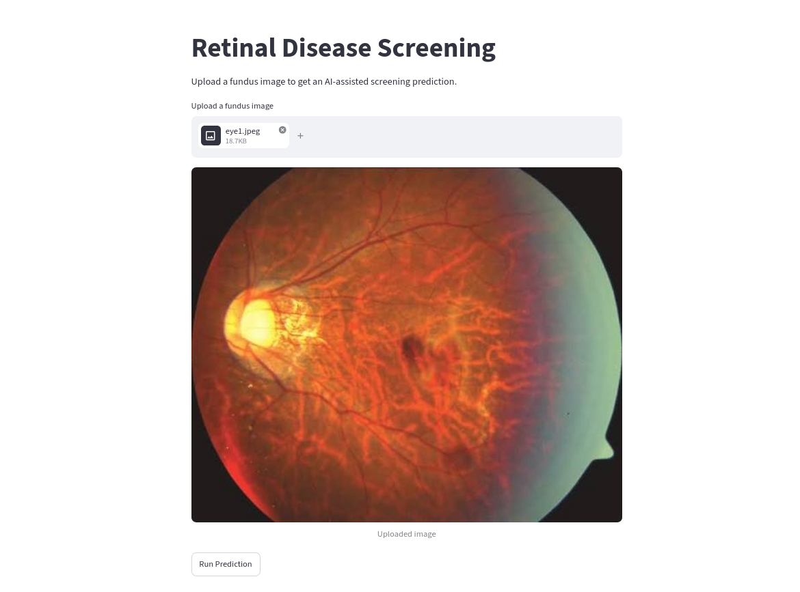
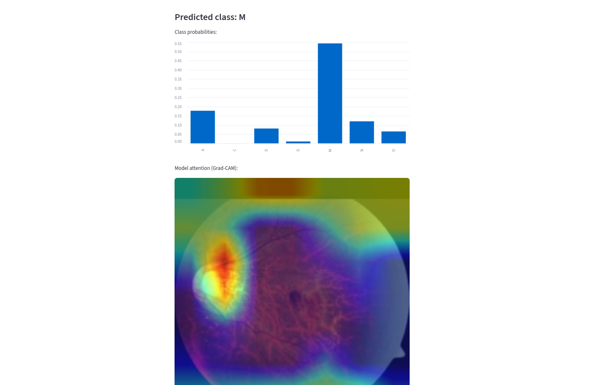
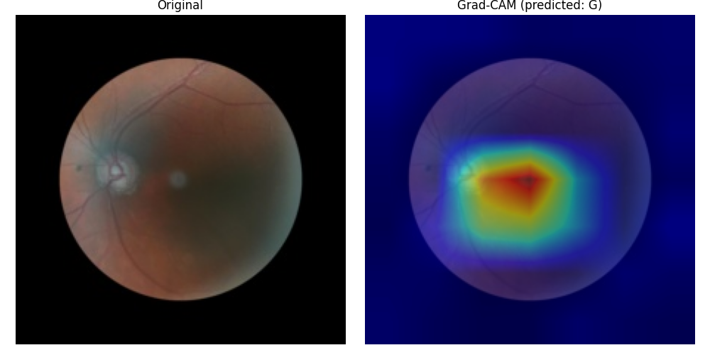

# Retinal Disease Screening System

An AI-assisted screening tool for retinal diseases from fundus images, built
during a 2026 summer internship at Afrique Med. Upload a fundus photo and get
a predicted diagnosis across 7 classes, along with a Grad-CAM visualization
showing which regions of the image most influenced the model's decision.

## Demo

| Upload | Result |
|---|---|
|  |  |

## Disease Classes
`N` Normal · `D` Diabetic Retinopathy · `O` Other · `C` Cataract ·
`G` Glaucoma · `A` Age-related Macular Degeneration · `M` Myopia

(Hypertensive Retinopathy was excluded from scope due to severe class
imbalance — see project report for details.)

## Stack
- PyTorch, EfficientNet-B0 (transfer learning, partially fine-tuned)
- ODIR-5K dataset
- FastAPI (backend inference API)
- Streamlit (frontend demo UI)

## Model Summary
- Multi-class classification, 7 classes, 224x224 input
- EfficientNet-B0 backbone, last 3 blocks fine-tuned, rest frozen
- Test set: 41.0% accuracy, macro-F1 0.431, macro-AUC 0.802
- Optimized for recall on rare classes over raw accuracy (clinical
  screening priority — a missed disease is worse than a false alarm)

## Model Interpretability
The model produces Grad-CAM visualizations showing which regions of the
retina most influenced its prediction — useful for sanity-checking whether
the model is looking at clinically plausible areas.



## Setup

```bash
conda env create -f environment.yml
conda activate retina
```

If `environment.yml` is out of date, `requirements.txt` (pip) is also
maintained as a fallback.

## Running the App

Two servers must run simultaneously, in separate terminals, from the
project root:

**Terminal 1 — backend:**
```bash
uvicorn app.api:app --reload
```

**Terminal 2 — frontend:**
```bash
streamlit run app/streamlit_app.py
```

This opens a browser tab where you can upload a fundus image and get a
prediction with a Grad-CAM overlay.

## Project Structure